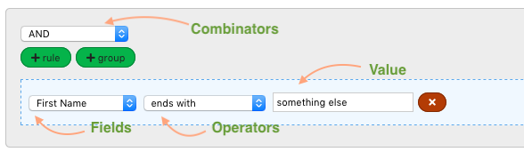

# React Query Builder

Driven by a need for a more customised query builder tool built in React, I developed an open source query builder that will output a structured JSON query object comprised of rules, rule-groups and a number of field components depending on desired input type.

## Getting Started

To get started simply add the query builder to your project like this:

```
npm i -D react-query-builder
```

### Viewing a demo of the query builder

You can [view a live demo](https://codesandbox.io/s/cool-fermi-yb1hb?fontsize=14&hidenavigation=1&theme=dark) of the project on CodeSandbox. 

Alternatively, if you wish to download the code and run the example locally, then you can do so by downloading the project, navigating your favourite terminal to the folder and running: 

```
npm run start
```

### Prerequisites

This is a react-based project and assumes that you have React installed, at least version 16.8.0.

### Building your first query

To begin with, you'll want to import the query builder project into your app or component:

```
import QBuilder from 'react-query-builder'
```

Next, you can render it wherever you wish like this:

```JavaScript
<QBuilder
    fields={}
    combinators={}
    onQueryChange={}
    useCustomStyles={}
    query={}
/>
```

The component receives a number of props as described below.

* **fields** - _required_ - an object comprising a list of (more details below).
* **combinators** - _required_ - an array of strings that allow users to select how to combine their query fields. Typical combinators are 'and' and 'or'.
* **onQueryChange** - _required_ - a function which will be called each time the query is updated and is passed a JSON object in args. 
* **useCustomStyles** - we provide a basic level of styling to the query builder that looks good without any intervention. If you'd prefer, however, to use your own styles then set this to true and style away!
* **query** - an initial structured JSON query object that, when available, will be rendered as a visual query by the component.



### Additional exports
<a id="additional-exports"></a>

The query builder also exports some helper string constants to aid in constructing the necessary schema to supply to the query builder, such as fields, operators and data types. 

```JavaScript
import { 
    FIELD_TYPES, 
    OPERATORS, 
    COMBINATORS, 
    DATA_TYPES 
} from 'react-query-builder';
```

If you investigate the source files, you will discover more about what is contained within these constants, but in summary:

* **FIELD_TYPES** - contains a list of types of input fields that a user can use to input a query value. For example, if you supply 'DATE' then the user will be able to use a datepicker (**defaults to TEXT**).
* **OPERATORS** - this exposes a list of popular and common operators, such as 'in', 'equals', 'before', etc. These can be supplied with a field if you want to override default operators that are defined based on the field's data type. **Note, this is completely optional**.
* **COMBINATORS** - a lot more restricted (i.e. we only have 'and' and 'or' for now), but exposes a list combinators that join each part of the query together, such as 'AND'.
* **DATA_TYPES** - data types outlines a small list of types of data, such as number, string, boolean, etc. When supplying a data type with a field (see [Fields](#fields) below), they also pre-select a list of operators. For example, if you supply 'bool', a user's operator choice is limited to 'IS' and 'IS_NOT'.

#### Fields
<a id="fields"></a>

The query builder should be supplied with an array of field objects. These fields populate the first select element in each rule of the query builder. They also dictate what operators are available to be selected depending on each field.

At a basic level, all you need to supply is a 'label' and a 'name', but you can also supply a 'dataType' and 'type' properties to further control which options are available to your user.

Here are the common properties that can be supplied to a field object:

* **label** - This is purely cosmetic and is displayed to the user in the field select element.
* **name** - Once selected by the user, the name of the field you set here is passed into the final query JSON returned by the component.
* **dataType** - Quite handily, the data type property controls a preset list of operators bound to each type. For example, if you select 'string' here, the user will see different operators then if you set 'date'. For more explaination on data types, see the [data types section](#additional-exports) above. 
* **type** - The field type allows you to control what input the user sees to enter their query value. For example, if you choose 'autocomplete' and supply a list of data, the user can search for and find their value from an autocomplete list. **Note if not set, this defaults to a simple text input**.
* **operators** - Completely optional, if you wish to override the operators for this field then you can supply a string array here which will populate the operators select element when this field is chosen.

There are some more properties available, depending on the field type, but this document will be fleshed out as these components are built out.

```JavaScript
const fields = [
        // Basic field
        {
            label: 'Basic field',
            name: 'basicfield',
        },
        // Selecting a data type and value type
        {
            label: 'First Name',
            name: 'firstName',
            dataType: DATA_TYPES.STRING,
            type: FIELD_TYPES.TEXT,
        }
        // A more custom example with specific operator overrides and data for the autocomplete list
        {
            label: 'Users',
            name: 'users',
            dataType: DATA_TYPES.STRING,
            type: FIELD_TYPES.AUTOCOMPLETE_LIST,
            operators: [
                'in',
                'with',
                'has not',
                'anything you like'
            ],
            // The autocomplete field type requires a data property which is an object array of 
            // name/value pairs
            data: [
                {
                    name: 'Abraham Lincoln',
                    value: 123
                },
                ...
                {
                    name: 'Mr Black',
                    value: 99
                },
            ]
        }
    ];
```

#### Combinators

Combinators simply join each rule group together. It accepts an array of strings and will populate the combinators select box (see query builder example image above).

```JavaScript
const combinators = [
        COMBINATORS.AND, // using the exported string constants
        'maybe' // using an ordinary string
    ];
```

#### Query

As well as exporting a JSON object as the query builds, the component also accepts a query object as a starting point. It might be that you have a previously built and saved query that you need to load and have represented visually.

You can see an example of a simple query below.

```JavaScript
const initialQuery = {
    "id": "q-eYzqvRpGZWXoJXTSZQAtF",
    "rules": [
        {
            "id": "g-x2P0kgQPeepc9H_KF2VmA",
            "rules": [
                {
                    "id": "r-zVFiaM-ofW-yRzmWzrWAG",
                    "field": "firstName",
                    "value": "smith",
                    "operator": "ends with"
                },
                {
                    "id": "r-Xwk620lbgiJCfKMXRiSD-",
                    "field": "firstName",
                    "value": "Janet",
                    "operator": "!="
                },
                {
                    "id": "g-0OJl1mefHvEJK8pwZaFYg",
                    "rules": [
                        {
                            "id": "r-MYoJoveeQxcoLhsrJNVu9",
                            "field": "users",
                            "value": "123",
                            "operator": "is not"
                        }
                    ],
                    "combinator": "OR",
                    "not": false
                }
            ],
            "combinator": "AND",
            "not": false
        }
    ]
}
```

## Built With

* [React](https://reactjs.org/) - A JavaScript library for building user interfaces

## Contributing

If there's a feature you'd like to see implemented or have issues, or bugs then please send a detailed 

## Versioning

We use [SemVer](http://semver.org/) for versioning. 

## Authors

* **Rob Kendal** - [Find me on Twitter](https://twitter.com/kendalmintcode)

You can also find more from Rob Kendal via [his website](https://robkendal.co.uk) and [his GitHub account](https://github.com/bpk68).

## License

This project is licensed under the MIT License - see the [LICENSE.md](LICENSE.md) file for details

## Acknowledgments

* Big thanks to the excellent [query builder](https://github.com/sapientglobalmarkets/react-querybuilder) work from Sapient Global Markets for the initial inspiration for this project.

